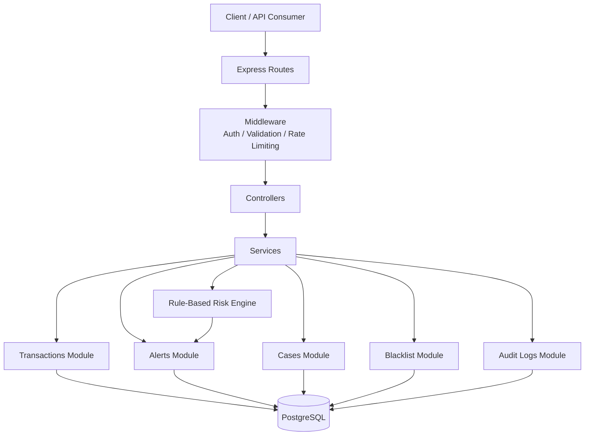

# FinGuard

**Status: Active Development**

**Current Version : MVP**

## Production-Inspired Rule-Based Fraud Detection Backend

FinGuard is an educational backend project that demonstrates how a fraud detection platform can be designed using modern backend development practices.

The project is built with Node.js, Express, PostgreSQL, JWT authentication, Zod validation, automated testing, and a rule-based risk engine.

Its purpose is to showcase backend architecture, security awareness, auditability, risk evaluation logic, and software engineering practices in a portfolio-friendly project.

⸻

## ⚠️ Important Disclaimer

FinGuard is an educational and portfolio project.

This project:
- Uses synthetic/demo data only.
- Does not connect to real banks or payment systems.
- Is not a real fraud detection platform.
- Is not an AML system.
- Is not a KYC system.
- Is not a compliance platform.
- Is not intended for financial decision making.
- Is not production-ready software.

The project is a production-inspired educational demonstration of how a fraud monitoring backend might be structured.

⸻

## Why This Project Exists

The goal of FinGuard is to explore how modern backend systems can be structured when dealing with authentication, transactions, risk evaluation, alert management, auditability, and security-focused development practices.

Rather than solving real-world financial problems, the project focuses on demonstrating software engineering concepts using synthetic data and a rule-based risk engine.

⸻

## Features

Authentication
- User registration
- User login
- JWT-based authentication
- Protected routes
- Password hashing with bcrypt

Transaction Monitoring
- Transaction creation
- Transaction history
- Ownership-based access control

Rule-Based Risk Engine
- Transaction evaluation
- Alert generation
- Multiple risk rules
- Extensible architecture for future rules

Alerts
- Automatic alert creation
- Alert status workflow
- Pagination
- Filtering
- Sorting

Cases
- Case creation
- Case status management
- Alert-to-case relationship

Blacklist
- Blacklist entity management
- Blacklist-based risk detection

Audit Logs
- Audit trail generation
- Entity change tracking
- User action tracking

Security-Aware Design
- Authentication
- Authorization
- Input validation
- Rate limiting
- Secure configuration practices

Automated Testing
- Integration testing
- Module-based test structure
- API validation

⸻

## Tech Stack

Backend
- Node.js
- Express

Database
- PostgreSQL
- pg

Authentication
- JWT
- bcrypt

Validation
- Zod

Security
- Helmet
- CORS
- express-rate-limit

Testing
- Jest
- Supertest

Utilities
- dotenv
- Prettier

⸻
### System Architecture

### Request Flow

Client → Routes → Middleware → Controllers → Services → PostgreSQL

### Design principles:
- Controllers contain no SQL
- Services contain business logic
- Validation is handled through middleware
- Authentication is centralized
- Risk evaluation is isolated from transaction creation
- Database access uses parameterized queries

⸻

## Core Modules

### Authentication
- User registration
- User login
- JWT authentication
- Protected routes

### Transactions
- Transaction creation
- Transaction validation
- User ownership checks

### Risk Engine
- Rule-based risk evaluation
- Alert generation
- Risk classification

### Alerts
- Alert creation
- Status management
- Filtering and pagination

### Cases
- Investigation workflow
- Alert escalation

### Blacklist
- Blacklisted entity management
- Blacklist matching rules

### Audit Logs
- Security event tracking
- Audit trail generation
⸻

## Risk Engine

Current risk rules:

1.HIGH_AMOUNT

Triggered when a transaction exceeds the high-risk threshold.

2.CRITICAL_AMOUNT

Triggered when a transaction exceeds the critical threshold.

3.SUSPICIOUS_WITHDRAWAL_OR_TRANSFER

Triggered when large withdrawals or transfers occur.

4.BLACKLIST_MATCH

Triggered when a transaction references a blacklisted entity.

5.RAPID_TRANSACTIONS

Triggered when multiple transactions occur within a short time window.

6.MULTIPLE_HIGH_RISK_ALERTS

Triggered when a user already has multiple open high-risk alerts.

⸻

## Security Features

Implemented security controls:
- bcrypt password hashing
- JWT authentication
- Protected routes
- Ownership checks using user_id
- Parameterized SQL queries
- Authentication rate limiting
- Helmet security headers
- CORS configuration
- Request body size limits
- Production-safe error handling
- JSON-based 404 responses
- Environment variable validation
- .env.example template
- .gitignore protection

⸻

## API Overview

### Authentication

- POST /auth/register
- POST /auth/login
- GET /auth/me

### Transactions

- POST /transactions
- GET /transactions

### Alerts

- GET /alerts
- PATCH/alerts/:id/status

### Cases

- POST /cases
- GET /cases
- PATCH/cases/:id/status

### Blacklist

- GET /blacklist
- POST /blacklist
- DELETE /blacklit/ :id

### Audit Logs

- GET/audit-logs

⸻

## Enviornment Variables

Create a .env file using .env.example:

PORT=3000

NODE_ENV=development

DATABASE_URL=<your_database_url>

JWT_SECRET=<your_jwt_secret>

JWT_EXPIRES_IN=7d

Never commit real secrets to source control.

⸻

## Database Migrations

- Run all migrations

    npm run migrate

-  Run seed files

    npm run seed

-  Migrations files are stored in:

    src/db/migrations

Each database change is added as a separate migration file.

⸻

## Running the Project Locally:

- Install Dependencies:
npm install

-  Configure Enviornment Variables:
Create: .env
Using: .env.example

- Run Migrations:
npm run migrate

- Run Seed Data:
npm run seed

-  Start Development Server:
npm run dev

-  Start Production Servre:
npm start

⸻

## Running Tests:

- Run All Tests:
npm run test

- Formate Code:
npm run format

- Check Formatting:
npm run format: check

⸻

## Example API Requests

- Register Users

{
"email": "demo@example.com",
"password": "StrongPassword123"
}

- Login

{
"email": "demo@example.com",
"password": "StrongPassword123"
}

-  Create Transaction

Authorization: Bearer <token>

- Body

{
"amount": 15000,
"currency": "USD",
"type": "deposit"
}

⸻

## Design Decisions

Key architectural decisions:
- Modular Monolith architecture
- Service-layer business logic
- Route-level validation
- Rule-based risk engine
- Explicit database migrations
- Module-based test organization
- Synthetic data only
- Security-aware defaults

The project prioritizes clarity, maintainability, and learning value over complexity.

⸻

## Current Limitations

Current limitations include:
- No frontend dashboard
- No Docker support yet
- No CI/CD pipeline yet
- Rule-based detection only
- No risk scoring model
- No asynchronous event processing
- No Redis integration
- No email workflows
- No multi-factor authentication
- Educational synthetic data only

⸻

## Future Improvements

Planned enhancements:
-  Architecture diagram
- Docker support
- GitHub Actions CI
- Frontend dashboard
- Redis integration
- BullMQ queues
- Event-driven processing
- Risk scoring system
- Refresh tokens
- Logout functionality
- Email verification
- Password reset workflows
- Role-based access control
- Repository layer abstraction
- Additional risk rules
- Enhanced observability and logging

⸻

## License:

MIT License

⸻

## Educational Use

This project is intended for:
- Learning backend development
- Portfolio development
- Backend architecture practice
- Security-focused development practice
- Demonstrating software engineering concepts

All examples, transactions, alerts, cases, users, and risk events are synthetic and provided solely for educational and portfolio purposes.

This project is not intended for real financial monitoring, compliance operations, banking systems, or production fraud detection use cases.

---
